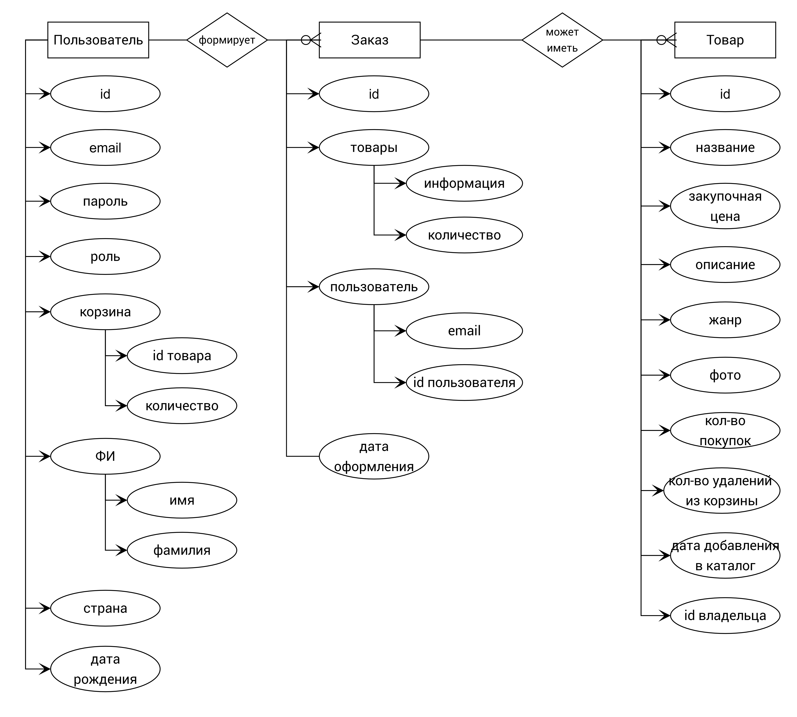

__1. Цель работы:__ разработать и реализовать интернет-магазин произведений искусства.

__2. Функциональные требования:__

Неавторизованный пользователь имеет право на:
* просмотр каталога товаров;
* просмотр описания товаров.
  
Клиент обладает набором всех функций гостя, а также имеет право на: 
* добавление и удаление товаров из корзины;
* оформление заказов;
* просмотр истории своих заказов и чеков к ним. 
  
Администратор обладает набором всех функций гостя и клиента, а также
имеет право на:
* редактирование описания товаров;
* создание и удаление товаров;
* просмотр списка своих добавленных товаров;
* регистрацию других администраторов.

Так же должны быть предусмотрены:
* регистрация и авторизация пользователей; 
* проверка правильности формата вводимых данных.

__3. Use-Case - диаграмма__

<!--  -->

<!--  -->

__4. ER-диаграмма сущностей__

__5. Макет Figma__
<code>[Art_Shop](https://www.figma.com/file/d1F1vLXfB9ZW2fMiV0ADW7/Art-Shop?node-id=0%3A1 "Магазин искусств")</code>